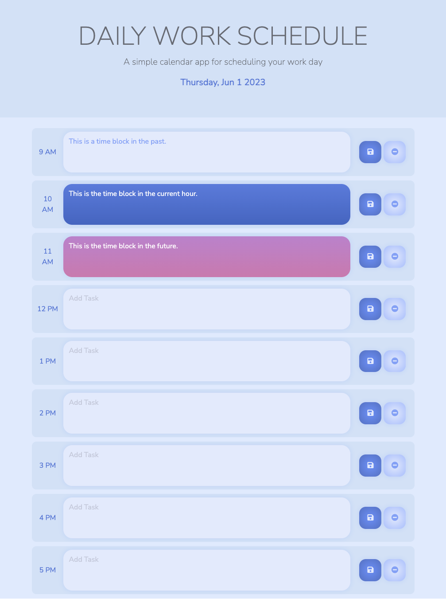

# Module 05 Challenge - Work Day Scheduler

## Description

This project demonstrates my ability to use third-party apis such as bootstrap, jQuery, dayjs and google fonts. The application was designed as an assignment for Module 05 of the coding bootcamp, and the full details of the user story and acceptance criteria are displayed below.

The daily work schedule application deployed here uses a custom font via Google Fonts, Bootstrap column sizing, dayjs api to call the date and time, and local storage to save user tasks in the hour time block in which they were created and saved in.

In addition to the initial criteria, I have also included a clear task button next to the save button, in the case that a user would like to clear only the task they have saved in that block. Although this was not required by the acceptance criteria, I assumed it to be extremely useful for any user of this application.

## Mockup



## Deployment

Below is the original instruction for this assignment.

[Click here to view the deployed application.](https://michiewillman.github.io/Module_05_Challenge/)

[Click here to view my code repository.](https://github.com/michiewillman/Module_05_Challenge)

# Work Day Scheduler Assignment Instructions

## Your Task

Create a simple calendar application that allows a user to save events for each hour of the day by modifying starter code. This app will run in the browser and feature dynamically updated HTML and CSS powered by jQuery.

You'll need to use the [Day.js](https://day.js.org/en/) library to work with date and time. Be sure to read the documentation carefully and concentrate on using Day.js in the browser.

## User Story

```md
AS AN employee with a busy schedule
I WANT to add important events to a daily planner
SO THAT I can manage my time effectively
```

## Acceptance Criteria

```md
GIVEN I am using a daily planner to create a schedule
WHEN I open the planner
THEN the current day is displayed at the top of the calendar
WHEN I scroll down
THEN I am presented with timeblocks for standard business hours
WHEN I view the timeblocks for that day
THEN each timeblock is color coded to indicate whether it is in the past, present, or future
WHEN I click into a timeblock
THEN I can enter an event
WHEN I click the save button for that timeblock
THEN the text for that event is saved in local storage
WHEN I refresh the page
THEN the saved events persist
```

The following animation demonstrates the application functionality:

<!-- @TODO: create ticket to review/update image) -->


---

© 2023 edX Boot Camps LLC. Confidential and Proprietary. All Rights Reserved.
